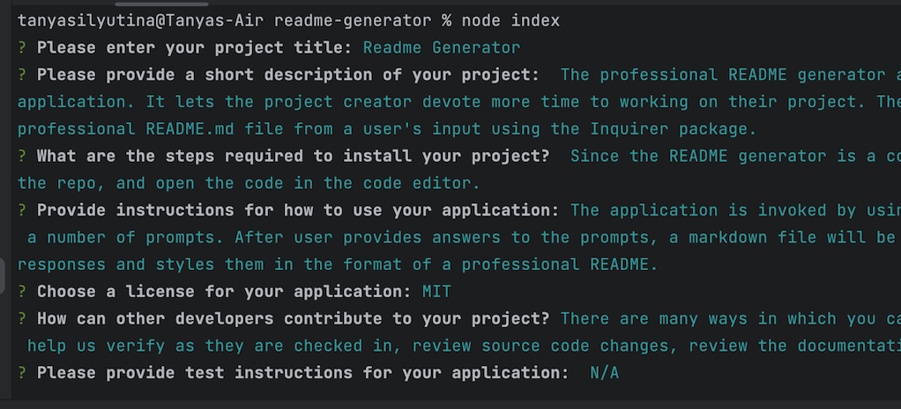

# README Generator

## Description
The professional README generator allows users to quickly and easily create a README file by using a command-line application. 
It lets the project creator devote more time to working on their project. 
The README generator is a command-line application that dynamically generates a professional README.md file from a user's input using the [Inquirer package](https://www.npmjs.com/package/inquirer/v/8.2.4).

Please see a [generated README example here](https://github.com/TanyaSilyutina/readme-generator/blob/main/utils/generateMarkdown.md).

## Installation
1. [Fork](https://github.com/TanyaSilyutina/readme-generator/fork) this repository.
2. In your terminal, clone your fork using `git clone <link to your fork>`.
3. In the project directory, run `npm i inquirer@8.2.4` to add node_modules folder.

## Usage
The application is invoked by using `node index.js` in the terminal. Please see a gif of the app's functionality below.
The terminal will present a number of prompts. After user provides answers to the prompts, a markdown file will be generated in their code editor. 
The newly generated file reflects user's responses and styles them in the format of a professional README.

You can view the [video demo here](https://drive.google.com/file/d/1-OoT7a9xA2YQ-f9JpzJ-0uGfRp4xDdCj/view).

## License
N/A

## Features
The application features an extended list of licenses. When a user picks a license, the license badge is displayed at the README header. 
Please see badge examples below:

