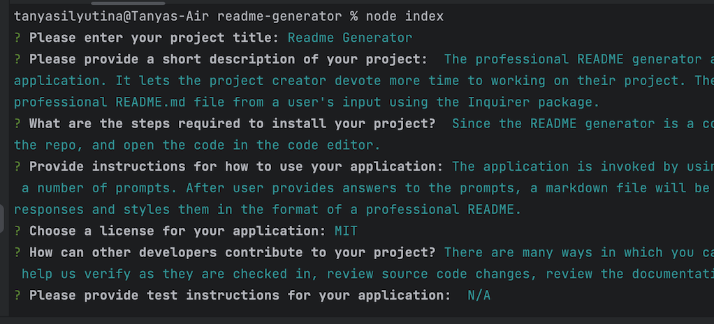

# README Generator

## Description
The professional README generator allows users to quickly and easily create a README file by using a command-line application. It lets the project creator devote more time to working on their project. The README generator is a command-line application that dynamically generates a professional README.md file from a user's input using the Inquirer package.
## Table of Contents

- [Installation](#installation)
- [Usage](#usage)
- [License](#license)
- [Questions](#questions)

## Installation
Since the README generator is a command-line application, I would recommend running it in your code editor. Clone the repo, and open the code in the code editor, and follow the terminal instructions.
## Usage
Please see a screenshot of the app's functionality below. The application is invoked by using the following command in the terminal: node index.js. The terminal will present a number of prompts. After user provides answers to the prompts, a markdown file will be generated in their code editor. The newly generated file reflects user's responses and styles them in the format of a professional README.

## License
Licensed under the MIT license.       
## How to Contribute
There are many ways in which you can participate in this project, for example: submit bugs and feature requests, and help us verify as they are checked in, review source code changes, review the documentation and make pull requests for anything from typos to additional and new content
## Tests
N/A
## Questions
Check out my [GitHub page](https://github.com/tanyasilyutina).

Please email me at *[silyutinatanya@gmail.com](mailto:silyutinatanya@gmail.com)* with additional questions.